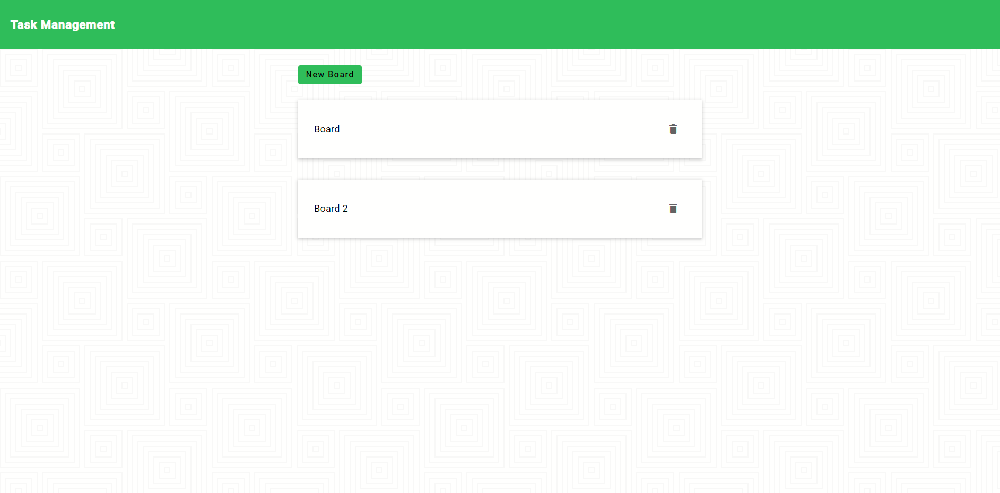
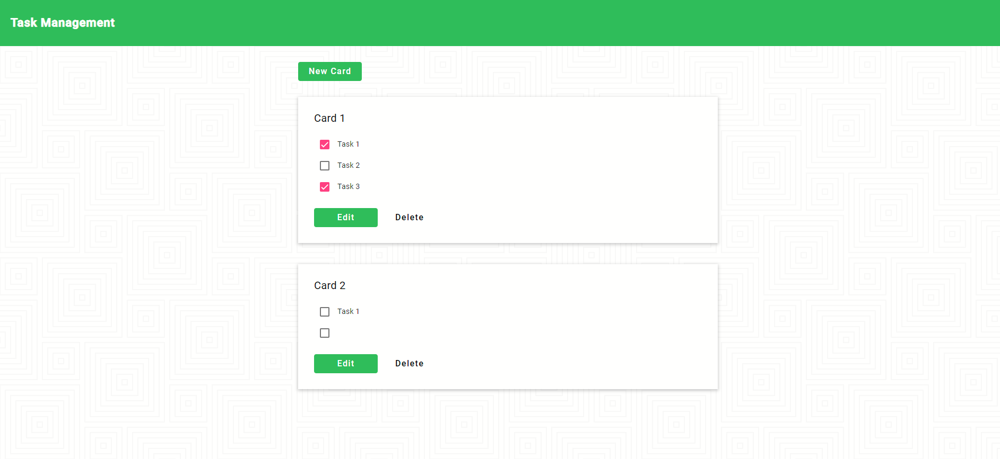

# Task Management



# Steps to clone this project

1. Clone Repository
    ```sh
    git clone https://lab.skynetinc.tech/WorldDrknss/Task.Management.git
    ```

2. `cd` into the cloned repository
    ```sh
    cd Task.Management
    ``` 

3. Install dependencies
    ```sh
    cd client && npm install
    ```
4. Run Servers
    * Inside the `client` directory
    ```sh
    npm start
    ```
# Technologies 🔥

 - HTML
 - CSS
 - Angular
 - Material
 - Local Storage
  
# Objective‼

 Build a dynamic web application that allows users to create task boards, cards, and tasks.
# Features ✨
* Angular
* Add, Edit, Delete Cards and Tasks
* Stored locally in local storage

# Contact:

Twitter - [@skynetinctech](https://twitter.com/skynetinctech)

Linkedin - [Charles Showalter](https://linkedin.com/in/charles-showalter)

Instagram - [@skynetinc.tech](https://twitter.com/skynetinc.tech)

Facebook - [@skynetinctech](https://facebook.com/skynetinctech)

Project Link: [https://lab.skynetinc.tech/WorldDrknss/Task.Management](https://lab.skynetinc.tech/WorldDrknss/Task.Management)